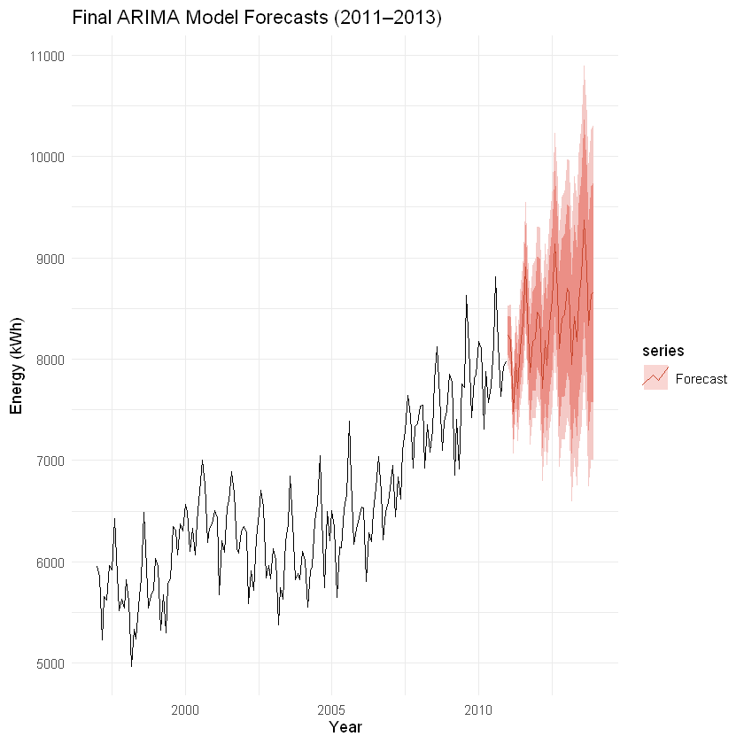

# Vancouver International Airport (YVR) Energy Consumption Forecasting

Time series forecasting of monthly energy consumption at Vancouver International Airport, built to support budget planning and energy procurement decisions.

## Problem

Airport operations need reliable energy consumption forecasts to negotiate procurement contracts and plan demand ahead of time. This project models 14 years of YVR monthly energy data and produces 3-year forward projections.

## Method

- Exploratory analysis of trend and yearly seasonality in the monthly series
- Box-Cox transformation to stabilize variance
- Seasonal ARIMA(1,1,0)(0,1,1)[12] fitted on the transformed series
- Holdout validation on the most recent observations

## Results

- **MAPE of 1.7%** on holdout data
- 3-year forward projections used to inform energy procurement contracts and demand planning

## Repository Contents

| Path | Description |
|---|---|
| `analysis/` | Rendered analysis notebook (HTML) with all code and diagnostics |
| `images/` | Key result charts |

## Tech Stack

R (forecast package: auto.arima, Box-Cox), time series analysis, Jupyter
